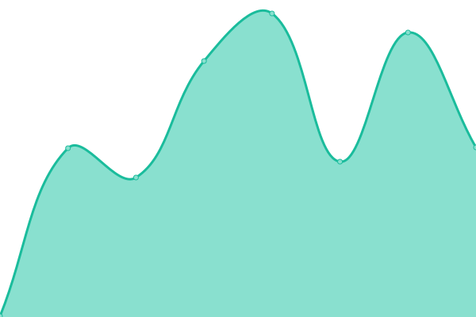
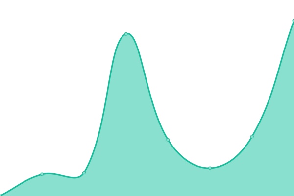
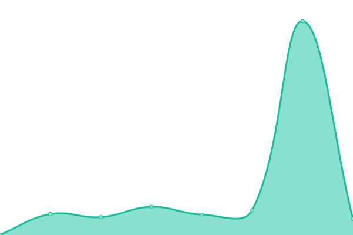
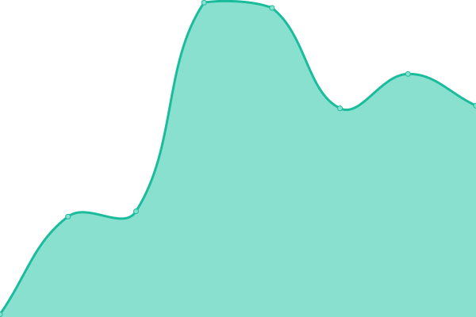
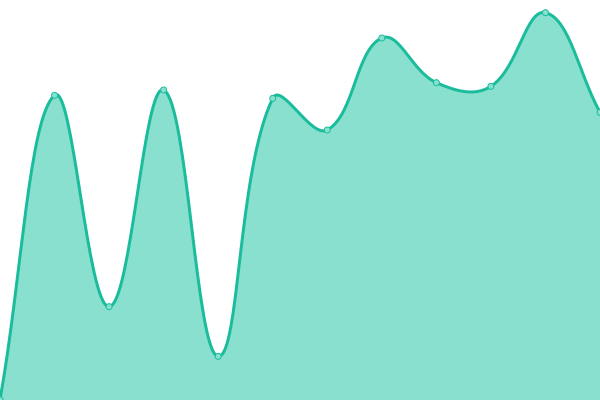
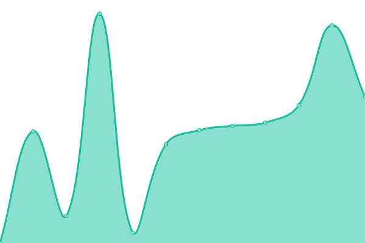
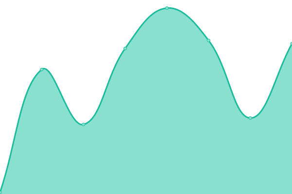
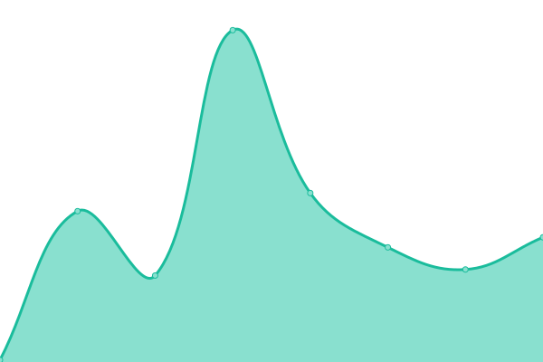

# [📈 Live Status](https://gregorip02.github.io/upptime): <!--live status--> **🟩 All systems operational**

This repository contains the open-source uptime monitor and status page for [RestaPros](https://lowurl.me/restapros-android), powered by [Upptime](https://github.com/upptime/upptime).

With [Upptime](https://upptime.js.org), you can get your own unlimited and free uptime monitor and status page, powered entirely by a GitHub repository. We use [Issues](https://github.com/gregorip02/upptime/issues) as incident reports, [Actions](https://github.com/gregorip02/upptime/actions) as uptime monitors, and [Pages](https://gregorip02.github.io/upptime) for the status page.

<!--start: status pages-->
<!-- This summary is generated by Upptime (https://github.com/upptime/upptime) -->
<!-- Do not edit this manually, your changes will be overwritten -->
<!-- prettier-ignore -->
| URL | Status | History | Response Time | Uptime |
| --- | ------ | ------- | ------------- | ------ |
|  [API (production)](https://v2.restapros.com) | 🟩 Up | [api-production.yml](https://github.com/gregorip02/upptime/commits/HEAD/history/api-production.yml) | 

 553ms
     
 | 

<a href="https://gregorip02.github.io/upptime/history/api-production">100.00%</a>
    

|  [API (development)](https://v2-dev.restapros.com) | 🟩 Up | [api-development.yml](https://github.com/gregorip02/upptime/commits/HEAD/history/api-development.yml) | 

 570ms
     
 | 

<a href="https://gregorip02.github.io/upptime/history/api-development">100.00%</a>
    

|  [Webapp (production)](https://web.restapros.com) | 🟩 Up | [webapp-production.yml](https://github.com/gregorip02/upptime/commits/HEAD/history/webapp-production.yml) | 

 305ms
     
 | 

<a href="https://gregorip02.github.io/upptime/history/webapp-production">100.00%</a>
    

|  [Webapp (development)](https://web-dev.restapros.com) | 🟩 Up | [webapp-development.yml](https://github.com/gregorip02/upptime/commits/HEAD/history/webapp-development.yml) | 

 279ms
     
 | 

<a href="https://gregorip02.github.io/upptime/history/webapp-development">100.00%</a>
    

|  [Invitation Page (production)](https://invite.restapros.com) | 🟩 Up | [invitation-page-production.yml](https://github.com/gregorip02/upptime/commits/HEAD/history/invitation-page-production.yml) | 

 1106ms
     
 | 

<a href="https://gregorip02.github.io/upptime/history/invitation-page-production">100.00%</a>
    

|  [Invitation Page (development)](https://invite-dev.restapros.com) | 🟩 Up | [invitation-page-development.yml](https://github.com/gregorip02/upptime/commits/HEAD/history/invitation-page-development.yml) | 

 929ms
     
 | 

<a href="https://gregorip02.github.io/upptime/history/invitation-page-development">100.00%</a>
    

|  [Orders Page (production)](https://orders.restapros.com) | 🟩 Up | [orders-page-production.yml](https://github.com/gregorip02/upptime/commits/HEAD/history/orders-page-production.yml) | 

 304ms
     
 | 

<a href="https://gregorip02.github.io/upptime/history/orders-page-production">100.00%</a>
    

|  [Orders Page (development)](https://orders-dev.restapros.com) | 🟩 Up | [orders-page-development.yml](https://github.com/gregorip02/upptime/commits/HEAD/history/orders-page-development.yml) | 

 301ms
     
 | 

<a href="https://gregorip02.github.io/upptime/history/orders-page-development">100.00%</a>
    

|  [Referrals Page (production)](https://referrals.restapros.com) | 🟩 Up | [referrals-page-production.yml](https://github.com/gregorip02/upptime/commits/HEAD/history/referrals-page-production.yml) | 

 233ms
     
 | 

<a href="https://gregorip02.github.io/upptime/history/referrals-page-production">100.00%</a>
    

|  [Referrals Page (development)](https://referrals-dev.restapros.com) | 🟩 Up | [referrals-page-development.yml](https://github.com/gregorip02/upptime/commits/HEAD/history/referrals-page-development.yml) | 

 308ms
     
 | 

<a href="https://gregorip02.github.io/upptime/history/referrals-page-development">100.00%</a>
    

|  [Multimedia Service](https://media.restapros.com) | 🟩 Up | [multimedia-service.yml](https://github.com/gregorip02/upptime/commits/HEAD/history/multimedia-service.yml) | 

 159ms
     
 | 

<a href="https://gregorip02.github.io/upptime/history/multimedia-service">100.00%</a>
    

|  [Assets](https://assets.restapros.com/static/images/restapros.png) | 🟩 Up | [assets.yml](https://github.com/gregorip02/upptime/commits/HEAD/history/assets.yml) | 

 80ms
     
 | 

<a href="https://gregorip02.github.io/upptime/history/assets">100.00%</a>
    

<!--end: status pages-->

[**Visit our status website →**](https://gregorip02.github.io/upptime)

## 📄 License

- Powered by: [Upptime](https://github.com/upptime/upptime)
- Code: [MIT](./LICENSE) © [Gregori Piñeres](https://lowurl.me/VIBLfqm)
- Data in the `./history` directory: [Open Database License](https://opendatacommons.org/licenses/odbl/1-0/)
